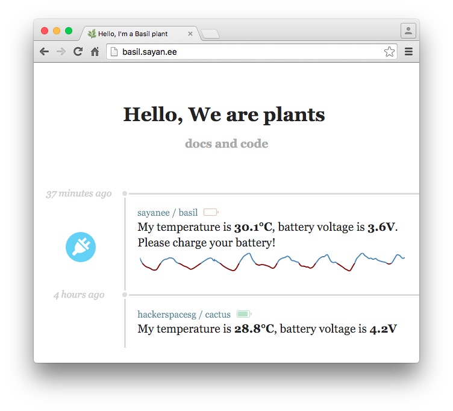

# Soil moisture sensor [[demo](http://basil.sayan.ee) and [api](http://basil.sayan.ee/api)]

> Monitoring soil moisture sensor of a basil plant to remind the owner to water it!

## Quick start

1. Wire up the [soil moisture sensor](http://www.seeedstudio.com/wiki/Grove_-_Moisture_Sensor) with [Particle Photon](https://store.particle.io/collections/photon) and flash it with the [firmware](firmware)
1. Install packages and set environment variables

  ```sh
  npm i
  cp .env.sample .env # set the device id and access token for the Particle Photon
  ```
- Start the web server `npm start`

  

## Wiring

- Turn `ON` the slider switch to wake up and ping samples from the sensor every `10 seconds`


## Bill of Materials

<table>
  <tr>
    <th>Part</th>
    <th>Function</th>
    <th>Quantity</th>
    <th>Cost (USD)</th>
    <th>Lead time (days)</th>
    <th>Buy</th>
  </tr>
  <tr>
    <td>Particle Photon</td>
    <td>Wifi + Microcontroller</td>
    <td>1</td>
    <td>19</td>
    <td>14</td>
    <td><a href="https://store.particle.io/collections/photon">Particle.io</a></td>
  </tr>
  <tr>
    <td>SparkFun Photon battery shield</td>
    <td>fuel guage and Lithium polymer battery charger</td>
    <td>1</td>
    <td>12.95</td>
    <td>21</td>  
    <td><a href="https://www.sparkfun.com/products/13626">Sparkfun</a></td>
  </tr>
  <tr>
    <td>Lithium polymer battery 2000mAh with JST connector and protection circuit</td>
    <td>to power the circuit and Photon</td>
    <td>1</td>
    <td>12.50</td>
    <td>14</td>
    <td><a href="https://www.adafruit.com/products/2011">Adafruit</a></td>
  </tr>
  <tr>
    <td>Slide switch</td>
    <td>On-off wakeup and samples</td>
    <td>1</td>
    <td>0.906</td>
    <td>28</td>
    <td><a href="http://sg.element14.com/webapp/wcs/stores/servlet/ProductDisplay?catalogId=15001&langId=65&urlRequestType=Base&partNumber=1905334&storeId=10191">element14</a></td>
  </tr>
  <tr>
    <td></td>
    <td></td>
    <td>TOTAL</td>
    <td>USD $45.36</td>
    <td>days 42</td>
    <td></td>
  </tr>
</table>
