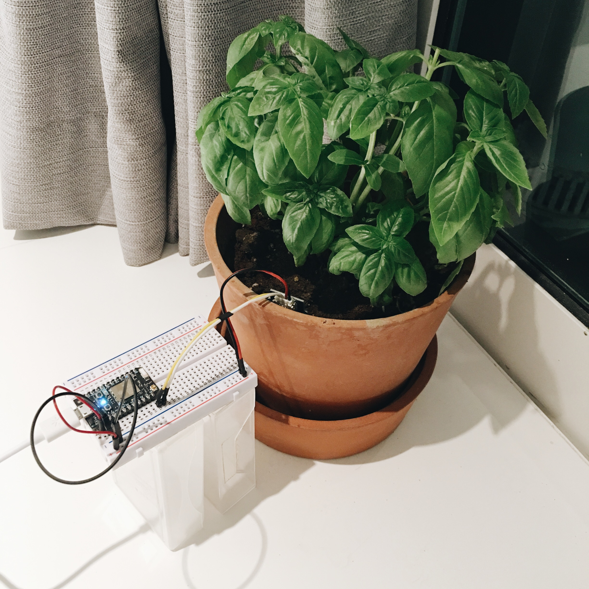
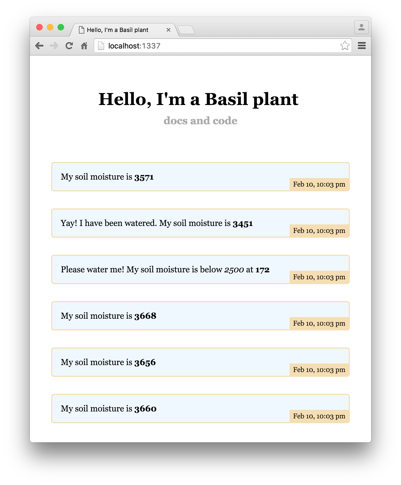
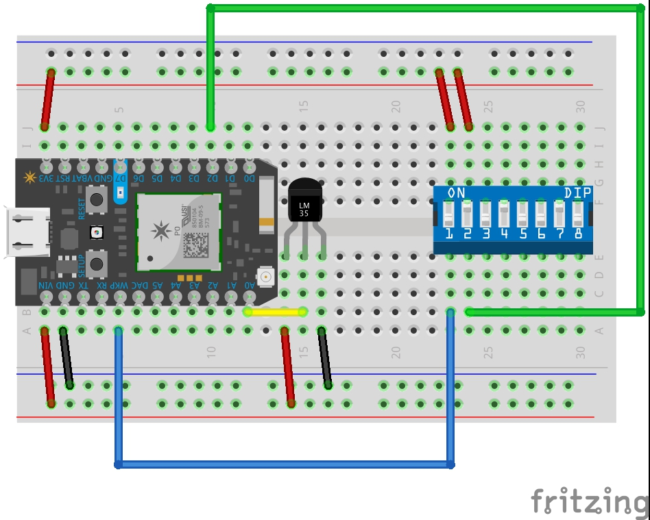

# Soil moisture sensor [[demo](http://basil.sayan.ee) and [api](http://basil.sayan.ee/api)]

> Monitoring soil moisture sensor of a basil plant to remind the owner to water it!

## Quick start

1. Wire up the [soil moisture sensor](http://www.seeedstudio.com/wiki/Grove_-_Moisture_Sensor) with [Particle Photon](https://store.particle.io/collections/photon) and flash it with the [firmware](firmware)
1. Install packages and set environment variables

  ```sh
  npm i
  cp .env.sample .env # set the device id and access token for the Particle Photon
  ```
- Start the web server `npm start`

  

## Wiring

- Turn on DIP `Switch 1` to wakeup - for flashing firmware
- Turn on DIP `Switch 1` and `Switch 2` for debug mode - for getting analog value every 5 seconds (instead of every hour)



## Research

### Sensors

1. [SparkFun](https://www.sparkfun.com/products/13322)
- [Grove](http://www.seeedstudio.com/wiki/Grove_-_Moisture_Sensor)
- [Cheap soil moisture sensor](http://gardenbot.org/howTo/soilMoisture/)

### Similar projects

1. [Instructables](http://www.instructables.com/id/Soil-Moisture-Sensor/)
- [Hackster](https://www.hackster.io/search?q=soil+moisture)
- [House plant monitor](https://learn.sparkfun.com/tutorials/sparkfun-inventors-kit-for-photon-experiment-guide/experiment-3-houseplant-monitor)
